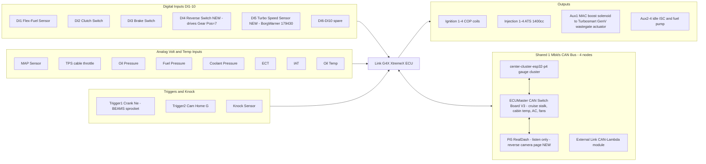

> Note (added when copied into the repo, 2026-09-04): this diagram still shows the DI4/DI5
> reverse-switch and turbo-speed-sensor placement from the 2026-08-19 decision, which the
> `ECU-wiring-design` branch's `DOCS-CLEANUP-PLAN.md` has since superseded (reverse switch is
> now switchboard-routed, not DI4; DI4 itself is committed to ABS wheel speed). See
> `REVERSE-CAMERA-TRIGGER-RESOLUTION.md` in this folder for the current answer. Kept as-is for
> history — not redrawn here.
